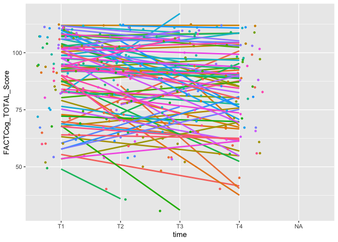

## Analysis for Sleep, PA Cancer


```r
data <- read_csv("/Users/dlf545/Documents/Ryan Collins Thesis/sleep_pa_cancer/analysis_data.csv")
```

```
## New names:
## Rows: 302 Columns: 102
## ── Column specification
## ──────────────────────────────────────────────────────── Delimiter: "," chr
## (24): p_id, time, PostalCode, DateCancerDiagnosis, PastTreatments, Past... dbl
## (62): ...1, sleep_minutes, mvpa_minutes, sed_light_minutes, sed_light_m... date
## (16): DOB, DOA1, DateCancerDiagnosis_CHARTS, DateFirstSurgery_CHARTS, D...
## ℹ Use `spec()` to retrieve the full column specification for this data. ℹ
## Specify the column types or set `show_col_types = FALSE` to quiet this message.
## • `` -> `...1`
```

## Quick example regression based on research question 1

To examine if higher levels of MVPA at baseline are associated with better subjective and objective cognitive function outcomes at T4 (1-year post-diagnosis) in the first year of cancer diagnosis in women with breast cancer.

* Outcome is subjective cognitive functionning (FACTCog_TOTAL_Score)
* Predictors are minutes of MVPA, Sleep, T1_Caffeine, and BMI

## Plot to check variation over time


```r
plot1 <- ggplot(data, aes(time, FACTCog_TOTAL_Score, group=p_id, color=p_id)) +
  geom_smooth(method="lm", se=F) +
  geom_jitter(size=1) +
  theme(legend.position="none") 
plot(plot1)
```

```
## `geom_smooth()` using formula 'y ~ x'
```

```
## Warning: Removed 16 rows containing non-finite values (stat_smooth).
```

```
## Warning: Removed 16 rows containing missing values (geom_point).
```

<!-- -->

This plot shows the individual trajectories of participants over time for the subjective cognitive functionning (FACTCog_TOTAL_Score) measure. Clearly differences in individuals and slops (we will deal with slopes late).

### Example regression


```r
model1 <- lmer(FACTCog_TOTAL_Score ~ sleep_minutes + mvpa_minutes + T1_Caffeine + BMI + (1 | p_id), data = data)
summary(model1)
```

```
## Linear mixed model fit by REML ['lmerMod']
## Formula: FACTCog_TOTAL_Score ~ sleep_minutes + mvpa_minutes + T1_Caffeine +  
##     BMI + (1 | p_id)
##    Data: data
## 
## REML criterion at convergence: 2314.8
## 
## Scaled residuals: 
##     Min      1Q  Median      3Q     Max 
## -2.3015 -0.5499  0.1112  0.4857  3.0492 
## 
## Random effects:
##  Groups   Name        Variance Std.Dev.
##  p_id     (Intercept) 245.8    15.68   
##  Residual             110.2    10.50   
## Number of obs: 283, groups:  p_id, 84
## 
## Fixed effects:
##                 Estimate Std. Error t value
## (Intercept)   94.2606922 10.0448797   9.384
## sleep_minutes  0.0006133  0.0091677   0.067
## mvpa_minutes  -0.0019655  0.0293791  -0.067
## T1_Caffeine   -0.9961528  1.1183693  -0.891
## BMI           -0.2083867  0.2700095  -0.772
## 
## Correlation of Fixed Effects:
##             (Intr) slp_mn mvp_mn T1_Cff
## sleep_mints -0.514                     
## mvpa_minuts -0.358  0.451              
## T1_Caffeine -0.303  0.047  0.019       
## BMI         -0.750  0.008 -0.156  0.023
```


