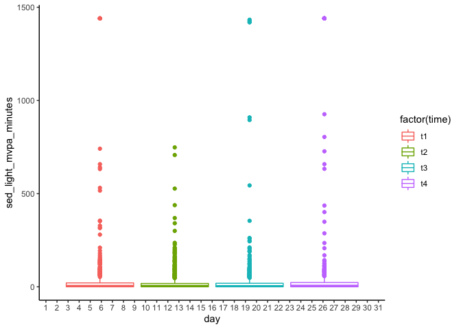

# Data Wrangling for Sleep, PA, and Cancer study


```r
sleep_data_temp <- NULL

sleep_data_temp <- dir(path = "Participant Data/", full.names = TRUE, pattern = "*.csv", recursive = TRUE) %>%
   purrr::map(function(i){
     dfhx <- read.csv(i, header = TRUE)
     dfhx$p_id <- stringr::str_sub(i, 19, 22)
     dfhx$time <- stringr::str_sub(i, 30, 31)
     sleep_data_temp <- bind_rows(sleep_data_temp, dfhx)
   })

merged_data <- bind_rows(sleep_data_temp)

glimpse(merged_data)
```

```
## Rows: 10,172,022
## Columns: 14
## $ Date   <chr> "01/16/2017", "01/16/2017", "01/16/2017", "01/16/2017", "01/16/…
## $ Time   <chr> "13:21:00", "13:22:00", "13:23:00", "13:24:00", "13:25:00", "13…
## $ ZCM    <int> 0, 268, 218, 326, 198, 280, 302, 342, 300, 288, 216, 120, 254, …
## $ SLEEP1 <int> 0, 0, 0, 0, 0, 0, 0, 0, 0, 0, 0, 0, 0, 0, 0, 0, 0, 0, 0, 0, 0, …
## $ p_id   <chr> "P001", "P001", "P001", "P001", "P001", "P001", "P001", "P001",…
## $ time   <chr> "t1", "t1", "t1", "t1", "t1", "t1", "t1", "t1", "t1", "t1", "t1…
## $ LZCM   <int> NA, NA, NA, NA, NA, NA, NA, NA, NA, NA, NA, NA, NA, NA, NA, NA,…
## $ PIM    <dbl> NA, NA, NA, NA, NA, NA, NA, NA, NA, NA, NA, NA, NA, NA, NA, NA,…
## $ Event  <int> NA, NA, NA, NA, NA, NA, NA, NA, NA, NA, NA, NA, NA, NA, NA, NA,…
## $ Bat    <int> NA, NA, NA, NA, NA, NA, NA, NA, NA, NA, NA, NA, NA, NA, NA, NA,…
## $ HPIM   <int> NA, NA, NA, NA, NA, NA, NA, NA, NA, NA, NA, NA, NA, NA, NA, NA,…
## $ LIFE   <int> NA, NA, NA, NA, NA, NA, NA, NA, NA, NA, NA, NA, NA, NA, NA, NA,…
## $ Light  <dbl> NA, NA, NA, NA, NA, NA, NA, NA, NA, NA, NA, NA, NA, NA, NA, NA,…
## $ Temp   <dbl> NA, NA, NA, NA, NA, NA, NA, NA, NA, NA, NA, NA, NA, NA, NA, NA,…
```

```r
table(merged_data$p_id)
```

```
## 
##   P001   P002   P003   P004   P005   P006   P007   P008   P009   P010   P012 
## 151519 165884 115890 118732 126587 109448 169577  87363 171529 130564 127855 
##   P014   P015   P016   P017   P018   P019   P021   P022   P023   P024   P025 
## 149753 120170  84559 121104  24457 109546  97028 149798  43223 122610 204951 
##   P026   P027   P028   P029   P030   P031   P033   P034   P035   P036   P037 
## 131701 127978 292656 245580  73746  81386 109771  24729 120319 113985  99496 
##   P038   P039   P040   P041   P042   P043   P044   P045   P046   P047   P048 
##  78417  12933 125192 102010  60247  18591 142661 123187 114654  86024  47674 
##   P049   P050   P051   P052   P053   P055   P056   P057   P058   P059   P060 
## 195964  85722  77158 118001  81082 138705  82778 100414 130965  77993 130605 
##   P061   P062   P063   P064   P065   P066   P067   P068   P069   P070   P071 
##  86642 136675  89180  76459  26148 130003  21359  87078  76347  24448 107908 
##   P072   P073   P074   P075   P076   P077   P079   P080   P081   P082   P083 
## 109572 138606 137343 106438  97744  89954  98099  93904  86526  96596 149325 
##   P084   P085   P088   P089   P091   P092   P093   P095   P096   P097   P098 
##  21586 135231 102105  96704  87737  87770  20159 103179  95989 122332 140806 
##   P099   P100   P101   P102   P104   P105   P106   P107   P108 
## 100723  97015  91858  92810  77716 120989  33604 121126 101758
```

```r
table(merged_data$time)
```

```
## 
##      t1      t2      t3      t4 
## 2991027 2667363 2345394 2168238
```

```r
rm(sleep_data_temp)
```

### Combining the time variables and creating a week variable


```r
merged_data$date_time <- with(merged_data, mdy(Date) + hms(Time))

merged_data$week_year <- week(merged_data$date_time)
merged_data$day <- day(merged_data$date_time)
```

### Creating physical activity variables 

I'm using a generalization of method from this paper  

Moran DS, Heled Y, Gonzalez RR. Metabolic rate monitoring and energy expenditure prediction using a novel actigraphy method. Med Sci Monit. 2004 Nov;10(11):MT117-20. Epub 2004 Oct 26. PMID: 15507861. [https://pubmed.ncbi.nlm.nih.gov/15507861/](https://pubmed.ncbi.nlm.nih.gov/15507861/)

- ZCM of 40 or greater is moderate to vigorous activity
- ZCM of 0 is sleep (**This is probably WRONG**)
- ZCM of sedentary to light activity is ZCM greater than 0 less than 40 


```r
merged_data <- merged_data %>% 
                mutate(activity_type = case_when(
                  ZCM >= 45 ~ "MVPA",
                  ZCM == 0 ~ "Sleep",
                  ZCM > 0 & ZCM < 40 ~ "Sed_Light"
                ))

#SLEEP1 == 0 and ZCM > 5? 

table(merged_data$activity_type)
```

```
## 
##      MVPA Sed_Light     Sleep 
##   2207823    737425   7173318
```

```r
summary(merged_data$SLEEP1)
```

```
##    Min. 1st Qu.  Median    Mean 3rd Qu.    Max.    NA's 
##    0.00    0.00    1.00    0.74    1.00    1.00   40679
```

```r
merged_data$sleep <- merged_data$SLEEP1
```

## Creating total time of week for summary activities


```r
merged_data <- merged_data %>%
	mutate(sed_light_mvpa_minutes = case_when(
		activity_type == "Sed_Light" ~ 1,
		activity_type == "Sleep" ~ 0,
		activity_type == "MVPA" ~ 1
	))

merged_data <- merged_data %>%
	mutate(mvpa_minutes = case_when(
		activity_type == "Sed_Light" ~ 0,
		activity_type == "Sleep" ~ 0,
		activity_type == "MVPA" ~ 1
	))

merged_data <- merged_data %>%
	mutate(sed_light_minutes = case_when(
		activity_type == "Sed_Light" ~ 1,
		activity_type == "Sleep" ~ 0,
		activity_type == "MVPA" ~ 0
	))

merged_data <- merged_data %>%
	mutate(sleep_minutes_zcm = case_when(
		activity_type == "Sed_Light" ~ 0,
		activity_type == "Sleep" ~ 1,
		activity_type == "MVPA" ~ 0
	))
```

### Summary Statistics - Sleep


```r
merged_data$total_sleep_mvpa_light <- merged_data$sleep + merged_data$mvpa_minutes + merged_data$sed_light_minutes
merged_data$total_sleep_mvpa_light_zcm <- merged_data$sleep_minutes_zcm + merged_data$mvpa_minutes + merged_data$sed_light_minutes

merged_data$day <- as.factor(merged_data$day)

day <- merged_data %>%
  group_by(p_id, day, time) %>%
    summarise(sleep_minutes = sum(sleep),
              sleep_minutes_zcm = sum(sleep_minutes_zcm),
              mvpa_minutes = sum(mvpa_minutes),
              sed_light_minutes = sum(sed_light_minutes),
              sed_light_mvpa_minutes = sum(sed_light_mvpa_minutes),
              total_sleep_mvpa_light = sum(total_sleep_mvpa_light),
              total_sleep_mvpa_light_zcm = sum(total_sleep_mvpa_light_zcm),
              zcm = mean(ZCM),
              total_minutes = n()
              )
```

```
## `summarise()` has grouped output by 'p_id', 'day'. You can override using the `.groups` argument.
```

```r
day$zcm <- as.integer(day$zcm)
summary(day$total_minutes)
```

```
##    Min. 1st Qu.  Median    Mean 3rd Qu.    Max. 
##      61    1440    1440    1455    1440    7200
```

A few observations are 7200 minutes in one day. Not sure why. Removing those observations. Prior to removing the observations there are 6989 observations in the day level dataset. 


```r
day <- filter(day, total_minutes <= 1440)
```

The new dataset has 6696 observations so we have removed 293 days of data, which represents 4.1% of the data. This is pretty normal. 

## Checking sleep data


```r
merged_data$sleep = merged_data$SLEEP1

merged_data$sleep_merge <- merged_data$sleep + merged_data$sleep_minutes_zcm

summary(merged_data$sleep_merge)
```

```
##    Min. 1st Qu.  Median    Mean 3rd Qu.    Max.    NA's 
##    0.00    1.00    2.00    1.44    2.00    2.00   92729
```

```r
table(merged_data$sleep_merge)
```

```
## 
##       0       1       2 
## 2286994 1022720 6769579
```

Around 10% of the observations have sleep in for the SLEEP1 variable or the ZCM variable but not both. This tends to be more more on the SLEEP1 variable. 

## Plot of ZCM sleep versus SLEEP1 variable


```r
sleep_plot <- ggplot(day, aes(x = sleep_minutes_zcm, y = sleep_minutes)) +
              geom_point() +
              theme_classic()
plot(sleep_plot)
```

```
## Warning: Removed 4194 rows containing missing values (geom_point).
```

<!-- -->

```r
cor(x = day$sleep_minutes_zcm, y = day$sleep_minutes, use = "complete.obs")
```

```
## [1] 0.7316938
```

Correlation between the two is high but SLEEP1 variable tends to be higher based on the plot


```r
day %>%
  group_by(time) %>%
    get_summary_stats(sleep_minutes)
```

```
## # A tibble: 4 × 14
##   time  variable        n   min   max median    q1    q3   iqr   mad  mean    sd
##   <chr> <chr>       <dbl> <dbl> <dbl>  <dbl> <dbl> <dbl> <dbl> <dbl> <dbl> <dbl>
## 1 t1    sleep_minu…  1839     0  1440   1155  567   1437  870   423.  988.  443.
## 2 t2    sleep_minu…  1727     0  1440   1259  570.  1440  870.  268. 1024.  444.
## 3 t3    sleep_minu…  1616     0  1440   1224  548   1440  892   320.  997.  464.
## 4 t4    sleep_minu…  1478     0  1440   1159  527.  1439  912.  417.  966.  470.
## # … with 2 more variables: se <dbl>, ci <dbl>
```

```r
day %>%
  group_by(time) %>%
    get_summary_stats(sleep_minutes_zcm)
```

```
## # A tibble: 4 × 14
##   time  variable        n   min   max median    q1    q3   iqr   mad  mean    sd
##   <chr> <chr>       <dbl> <dbl> <dbl>  <dbl> <dbl> <dbl> <dbl> <dbl> <dbl> <dbl>
## 1 t1    sleep_minu…   633     0  1440   1434 1389   1440  51    8.90 1296.  307.
## 2 t2    sleep_minu…   687   124  1440   1434 1406.  1440  34.5  8.90 1332.  249.
## 3 t3    sleep_minu…   678     2  1440   1435 1407   1440  33    7.41 1329.  270.
## 4 t4    sleep_minu…   526     0  1440   1433 1381.  1440  58.8 10.4  1264.  365.
## # … with 2 more variables: se <dbl>, ci <dbl>
```

```r
day %>%
  group_by(time) %>%
    get_summary_stats(mvpa_minutes)
```

```
## # A tibble: 4 × 14
##   time  variable        n   min   max median    q1    q3   iqr   mad  mean    sd
##   <chr> <chr>       <dbl> <dbl> <dbl>  <dbl> <dbl> <dbl> <dbl> <dbl> <dbl> <dbl>
## 1 t1    mvpa_minut…   633     0  1440      0     0     4     4     0  32.8 164. 
## 2 t2    mvpa_minut…   687     0   734      0     0     4     4     0  13.7  54.2
## 3 t3    mvpa_minut…   678     0  1430      0     0     3     3     0  19.9 123. 
## 4 t4    mvpa_minut…   526     0  1440      0     0     5     5     0  59.2 258. 
## # … with 2 more variables: se <dbl>, ci <dbl>
```

```r
day %>%
  group_by(time) %>%
    get_summary_stats(sed_light_minutes)
```

```
## # A tibble: 4 × 14
##   time  variable        n   min   max median    q1    q3   iqr   mad  mean    sd
##   <chr> <chr>       <dbl> <dbl> <dbl>  <dbl> <dbl> <dbl> <dbl> <dbl> <dbl> <dbl>
## 1 t1    sed_light_…   633     0    98      3     0    12    12  4.45  9.16  14.4
## 2 t2    sed_light_…   687     0   124      3     0    12    12  4.45 10.4   16.8
## 3 t3    sed_light_…   678     0   149      3     0    13    13  4.45 11.2   18.9
## 4 t4    sed_light_…   526     0   200      3     0    14    14  4.45 10.6   18.4
## # … with 2 more variables: se <dbl>, ci <dbl>
```

Average sleep minutes are around 990minutes with the SLEEP1 variable and 930minutes with the ZCM method per day, meaning they are sleeping around 16.5 hours per day or 15.5 hours per day. Maybe they are sleeping this much. There are many days were pepole are in sleep the entire time. The MVPA per day is around 300 minutes and is very consistent across the waves. This is too much MVPA but the threshold we are using might be low as well. Sed, light is around 110 minutes per day (1.8 hours). That is pretty low.  

### Checking daily MVPA and sleep overtime

### Plot for Sleep 

```r
sleep_plot <- ggplot(day, aes(x = day, y = sleep_minutes_zcm, group = time, colour = factor(time))) +
              geom_boxplot() +
              theme_classic()
plot(sleep_plot)
```

```
## Warning: Removed 4172 rows containing non-finite values (stat_boxplot).
```

<!-- -->

### Plot for MVPA

```r
mvpa_plot <- ggplot(day, aes(x = day, y = mvpa_minutes, group = time, colour = factor(time))) +
              geom_boxplot() +
              theme_classic()
plot(mvpa_plot)
```

```
## Warning: Removed 4172 rows containing non-finite values (stat_boxplot).
```

<!-- -->

### Plot for Sed, Light

```r
all_activity_plot <- ggplot(day, aes(x = day, y = sed_light_mvpa_minutes, group = time, colour = factor(time))) +
              geom_boxplot() +
              theme_classic()
plot(all_activity_plot)
```

```
## Warning: Removed 4172 rows containing non-finite values (stat_boxplot).
```

<!-- -->

# Aggregating to the day level 


```r
day_only <- day %>%
  group_by(p_id, time) %>%
    summarise(sleep_minutes = median(sleep_minutes, na.rm = TRUE),
              sleep_minutes_zcm = mean(sleep_minutes_zcm, na.rm = TRUE),
              mvpa_minutes = mean(mvpa_minutes, na.rm = TRUE),
              sed_light_minutes = mean(sed_light_minutes, na.rm = TRUE),
              sed_light_mvpa_minutes = mean(sed_light_mvpa_minutes, na.rm = TRUE),
              total_sleep_mvpa_light = mean(total_sleep_mvpa_light, na.rm = TRUE),
              total_sleep_mvpa_light_zcm = mean(total_sleep_mvpa_light_zcm, na.rm = TRUE),
              )
```

```
## `summarise()` has grouped output by 'p_id'. You can override using the `.groups` argument.
```

# Writing CSV files


```r
write_csv(day, "participant_days.csv")
write_csv(day_only, "days.csv")
```

# Pivoting and writing to SAV (SPSS) format


```r
day_only <- as.data.frame(day_only)

day_only_wide <- reshape(day_only, direction = "wide", idvar = "p_id", timevar = "time", v.names = c("sleep_minutes", "sleep_minutes_zcm", "mvpa_minutes", "sed_light_minutes", "sed_light_mvpa_minutes", "total_sleep_mvpa_light", "total_sleep_mvpa_light_zcm"), sep = "_")

day_only_wide$ParticipantNumber <- seq(1:97)

## SAV
write_sav(day_only_wide, "days_wide.sav")
```

