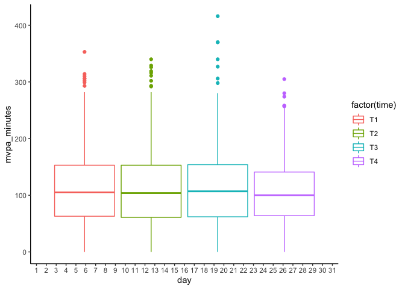

# Data Wrangling for Sleep, PA, and Cancer study


```r
sleep_data_temp <- NULL

sleep_data_temp <- dir(path = "Participant Data/", full.names = TRUE, pattern = "*.csv", recursive = TRUE) %>%
   purrr::map(function(i){
     dfhx <- read_csv(i, col_types = cols(.default = col_character()))
     dfhx$p_id <- stringr::str_sub(i, 19, 21)
     dfhx$time <- stringr::str_sub(i, 23, 24)
     sleep_data_temp <- bind_rows(sleep_data_temp, dfhx)
   })
```

```
## New names:
## * A_Sleep -> A_Sleep...6
## * A_Sleep -> A_Sleep...9
```

```
## New names:
## * A_Sleep -> A_Sleep...5
## * A_Sleep -> A_Sleep...8
## New names:
## * A_Sleep -> A_Sleep...5
## * A_Sleep -> A_Sleep...8
```

```
## New names:
## * A_SLeep -> A_SLeep...5
## * A_SLeep -> A_SLeep...8
```

```
## New names:
## * A_Sleep -> A_Sleep...5
## * A_Sleep -> A_Sleep...8
```

```r
merged_data <- bind_rows(sleep_data_temp)

glimpse(merged_data)
```

```
## Rows: 2,968,748
## Columns: 21
## $ Date        <chr> "1/23/2017", "1/23/2017", "1/23/2017", "1/23/2017", "1/23/…
## $ Time        <chr> "15:07:00", "15:08:00", "15:09:00", "15:10:00", "15:11:00"…
## $ ZCM         <chr> "136", "66", "110", "246", "274", "256", "282", "278", "18…
## $ A_Sleep     <chr> "0", "0", "0", "0", "0", "0", "0", "0", "0", "0", "0", "0"…
## $ TIB         <chr> "0", "0", "0", "0", "0", "0", "0", "0", "0", "0", "0", "0"…
## $ SLP         <chr> "0", "0", "0", "0", "0", "0", "0", "0", "0", "0", "0", "0"…
## $ M_Sleep     <chr> "0", "0", "0", "0", "0", "0", "0", "0", "0", "0", "0", "0"…
## $ p_id        <chr> "001", "001", "001", "001", "001", "001", "001", "001", "0…
## $ time        <chr> "t1", "t1", "t1", "t1", "t1", "t1", "t1", "t1", "t1", "t1"…
## $ LZCM        <chr> NA, NA, NA, NA, NA, NA, NA, NA, NA, NA, NA, NA, NA, NA, NA…
## $ PIM         <chr> NA, NA, NA, NA, NA, NA, NA, NA, NA, NA, NA, NA, NA, NA, NA…
## $ Event       <chr> NA, NA, NA, NA, NA, NA, NA, NA, NA, NA, NA, NA, NA, NA, NA…
## $ A_Sleep...6 <chr> NA, NA, NA, NA, NA, NA, NA, NA, NA, NA, NA, NA, NA, NA, NA…
## $ A_Sleep...9 <chr> NA, NA, NA, NA, NA, NA, NA, NA, NA, NA, NA, NA, NA, NA, NA…
## $ A_Sleep...5 <chr> NA, NA, NA, NA, NA, NA, NA, NA, NA, NA, NA, NA, NA, NA, NA…
## $ A_Sleep...8 <chr> NA, NA, NA, NA, NA, NA, NA, NA, NA, NA, NA, NA, NA, NA, NA…
## $ A_SLeep...5 <chr> NA, NA, NA, NA, NA, NA, NA, NA, NA, NA, NA, NA, NA, NA, NA…
## $ A_SLeep...8 <chr> NA, NA, NA, NA, NA, NA, NA, NA, NA, NA, NA, NA, NA, NA, NA…
## $ HPIM        <chr> NA, NA, NA, NA, NA, NA, NA, NA, NA, NA, NA, NA, NA, NA, NA…
## $ Light       <chr> NA, NA, NA, NA, NA, NA, NA, NA, NA, NA, NA, NA, NA, NA, NA…
## $ B_Sleep     <chr> NA, NA, NA, NA, NA, NA, NA, NA, NA, NA, NA, NA, NA, NA, NA…
```

```r
table(merged_data$p_id)
```

```
## 
##   001   002   003   004   005   006   007   008   009   010   012   014   015 
## 39445 29965 40365 40523 30297 40597 29042 38672 40422 19738 40290 42019 40804 
##   016   017   018   019   021   022   023   024   025   026   027   028   030 
## 20270 40183  9787 39752 40897 39648 20539 39864 39264 39148 38087 10684 40419 
##   031   033   034   035   036   037   038   039   040   041   042   043   044 
## 38733 38880 10155 19754 39961 38885 20476  9751 30379 31854 19518 10459 41535 
##   045   046   047   049   050   051   052   053   054   055   056   057   058 
## 30217 36344 30174 40690 41733 39771 30655 19881 10539 29470 40580 39850 30605 
##   059   060   061   063   064   065   066   067   068   069   070   071   072 
## 30914 29365 30540 31149 41565  9499 28627 10773 30315 39381  9796 29778 39975 
##   073   074   075   076   077   079   080   081   082   083   084   085   088 
## 42191 40328 40691 40792 29475 31441 41949 37585 39967 39764  9324  9815 28241 
##   089   091   092   093   095   096   097   098   099   100   101   102   104 
## 29570 30532 40807 10127 40109 29425 21263 36976 40758 30742 29189 19650 41084 
##   105   106   107   108 
## 10192 19902 40570 43042
```

```r
table(merged_data$time)
```

```
## 
##     t1     t2     t3     t4 
## 864539 766537 725228 612444
```

```r
rm(sleep_data_temp)
```

### Combining the time variables and creating a week variable


```r
merged_data$date_time <- with(merged_data, mdy(Date) + hms(Time))

merged_data$week_year <- week(merged_data$date_time)
merged_data$day <- day(merged_data$date_time)
```

### Creating physical activity variables 

I'm using a generalization of method from this paper  

Moran DS, Heled Y, Gonzalez RR. Metabolic rate monitoring and energy expenditure prediction using a novel actigraphy method. Med Sci Monit. 2004 Nov;10(11):MT117-20. Epub 2004 Oct 26. PMID: 15507861. [https://pubmed.ncbi.nlm.nih.gov/15507861/](https://pubmed.ncbi.nlm.nih.gov/15507861/)

- ZCM of 40 or greater is moderate to vigorous activity
- ZCM of 0 is sleep (**This is probably WRONG**)
- ZCM of sedentary to light activity is ZCM greater than 0 less than 40 


```r
merged_data <- merged_data %>% 
                mutate(activity_type = case_when(
                  ZCM >= 45 ~ "MVPA",
                  ZCM == 0 ~ "ZCM_Sleep",
                  ZCM > 0 & ZCM < 40 ~ "Sed_Light"
                ))

### Fix activity type for M_Sleep instead of ZCM sleep

merged_data <- merged_data %>% 
                mutate(activity_type_sleep = case_when(
                  M_Sleep == 1 ~ "sleep",
                  ZCM >= 45 ~ "mvpa",
                  ZCM < 45 ~ "sed_light"
                ))

table(merged_data$activity_type_sleep)
```

```
## 
##      mvpa sed_light     sleep 
##    262727   1881792    824229
```

```r
merged_data$M_Sleep <- as.numeric(merged_data$M_Sleep)
```

```
## Warning: NAs introduced by coercion
```

```r
merged_data$TIB <- as.numeric(merged_data$TIB)
merged_data$SLP <- as.numeric(merged_data$SLP)
merged_data$ZCM <- as.numeric(merged_data$ZCM)
```

## Creating total time of week for summary activities


```r
merged_data <- merged_data %>%
	mutate(sed_light_mvpa_minutes = case_when(
		activity_type_sleep == "sed_light" ~ 1,
		activity_type_sleep == "sleep" ~ 0,
		activity_type_sleep == "mvpa" ~ 1
	))

merged_data <- merged_data %>%
	mutate(mvpa_minutes = case_when(
		activity_type_sleep == "sed_light" ~ 0,
		activity_type_sleep == "sleep" ~ 0,
		activity_type_sleep == "mvpa" ~ 1
	))

merged_data <- merged_data %>%
	mutate(sed_light_minutes = case_when(
		activity_type_sleep == "sed_light" ~ 1,
		activity_type_sleep == "sleep" ~ 0,
		activity_type_sleep == "mvpa" ~ 0
	))

merged_data <- merged_data %>%
	mutate(sleep = case_when(
		activity_type_sleep == "sed_light" ~ 0,
		activity_type_sleep == "sleep" ~ 1,
		activity_type_sleep == "mvpa" ~ 0
	))
```

### Summary Statistics - Sleep


```r
merged_data$total_sleep_mvpa_light <- merged_data$sleep + merged_data$mvpa_minutes + merged_data$sed_light_minutes

table(merged_data$total_sleep_mvpa_light)
```

```
## 
##       1 
## 2968748
```

```r
summary(merged_data$total_sleep_mvpa_light)
```

```
##    Min. 1st Qu.  Median    Mean 3rd Qu.    Max. 
##       1       1       1       1       1       1
```

```r
merged_data$day <- as.factor(merged_data$day)

day <- merged_data %>%
  group_by(p_id, day, time) %>%
    summarise(sleep_minutes = sum(sleep),
              mvpa_minutes = sum(mvpa_minutes),
              sed_light_minutes = sum(sed_light_minutes),
              sed_light_mvpa_minutes = sum(sed_light_mvpa_minutes),
              total_sleep_mvpa_light = sum(total_sleep_mvpa_light),
              tib = sum(TIB),
              slp = sum(SLP),
              zcm = mean(ZCM),
              total_minutes = n()
              )
```

```
## `summarise()` has grouped output by 'p_id', 'day'. You can override using the `.groups` argument.
```

```r
day$zcm <- as.integer(day$zcm)
summary(day$total_minutes)
```

```
##    Min. 1st Qu.  Median    Mean 3rd Qu.    Max. 
##       1    1440    1440    1255    1440    1440
```

## Plot of ZCM sleep versus SLEEP1 variable


```r
summary(day$sleep_minutes)
```

```
##    Min. 1st Qu.  Median    Mean 3rd Qu.    Max. 
##     0.0   298.0   385.0   348.4   448.0  1403.0
```

```r
sleep_plot <- ggplot(day, aes(x = sleep_minutes)) +
              geom_histogram() +
              theme_classic()
plot(sleep_plot)
```

```
## `stat_bin()` using `bins = 30`. Pick better value with `binwidth`.
```

<!-- -->

### Summary stats for all variables 


```r
day %>%
  group_by(time) %>%
    get_summary_stats(sleep_minutes)
```

```
## # A tibble: 4 × 14
##   time  variable        n   min   max median    q1    q3   iqr   mad  mean    sd
##   <chr> <chr>       <dbl> <dbl> <dbl>  <dbl> <dbl> <dbl> <dbl> <dbl> <dbl> <dbl>
## 1 t1    sleep_minu…   690     0  1403    389  297.  452   155. 109.   352.  177.
## 2 t2    sleep_minu…   613     0  1402    387  301   448   147   99.3  358.  177.
## 3 t3    sleep_minu…   577     0   618    380  277   447   170  114.   336.  156.
## 4 t4    sleep_minu…   486     0   607    385  300.  440.  140   96.4  345.  150.
## # … with 2 more variables: se <dbl>, ci <dbl>
```

```r
day %>%
  group_by(time) %>%
    get_summary_stats(mvpa_minutes)
```

```
## # A tibble: 4 × 14
##   time  variable        n   min   max median    q1    q3   iqr   mad  mean    sd
##   <chr> <chr>       <dbl> <dbl> <dbl>  <dbl> <dbl> <dbl> <dbl> <dbl> <dbl> <dbl>
## 1 t1    mvpa_minut…   690     0   353    106    65   155    90  66.7  113.  65.0
## 2 t2    mvpa_minut…   613     0   340    104    61   153    92  65.2  111.  65.8
## 3 t3    mvpa_minut…   577     0   416    107    62   154    92  66.7  112.  65.8
## 4 t4    mvpa_minut…   486     0   305    101    66   142    76  57.1  107.  57.8
## # … with 2 more variables: se <dbl>, ci <dbl>
```

```r
day %>%
  group_by(time) %>%
    get_summary_stats(sed_light_minutes)
```

```
## # A tibble: 4 × 14
##   time  variable        n   min   max median    q1    q3   iqr   mad  mean    sd
##   <chr> <chr>       <dbl> <dbl> <dbl>  <dbl> <dbl> <dbl> <dbl> <dbl> <dbl> <dbl>
## 1 t1    sed_light_…   690     0  1328    875  749.  947.  198.  133.  788.  267.
## 2 t2    sed_light_…   613     1  1273    876  755   948   193   122.  781.  279.
## 3 t3    sed_light_…   577     1  1408    872  781   962   181   135.  808.  276.
## 4 t4    sed_light_…   486     2  1307    890  797.  948.  150.  108.  808.  259.
## # … with 2 more variables: se <dbl>, ci <dbl>
```

### Checking daily MVPA and sleep overtime

### Plot for Sleep 

```r
sleep_plot <- ggplot(day, aes(x = day, y = sleep_minutes, group = time, colour = factor(time))) +
              geom_boxplot() +
              theme_classic()
plot(sleep_plot)
```

<!-- -->

### Plot for MVPA

```r
mvpa_plot <- ggplot(day, aes(x = day, y = mvpa_minutes, group = time, colour = factor(time))) +
              geom_boxplot() +
              theme_classic()
plot(mvpa_plot)
```

<!-- -->

### Plot for Sed, Light

```r
all_activity_plot <- ggplot(day, aes(x = day, y = sed_light_mvpa_minutes, group = time, colour = factor(time))) +
              geom_boxplot() +
              theme_classic()
plot(all_activity_plot)
```

<!-- -->

# Aggregating to the day level 


```r
day_summary <- day %>%
  group_by(p_id, time) %>%
    summarise(sleep_minutes = median(sleep_minutes, na.rm = TRUE),
              mvpa_minutes = mean(mvpa_minutes, na.rm = TRUE),
              sed_light_minutes = mean(sed_light_minutes, na.rm = TRUE),
              sed_light_mvpa_minutes = mean(sed_light_mvpa_minutes, na.rm = TRUE),
              total_sleep_mvpa_light = mean(total_sleep_mvpa_light, na.rm = TRUE),
              tib = sum(tib, na.rm = TRUE),
              slp = sum(slp, na.rm = TRUE),
              )
```

```
## `summarise()` has grouped output by 'p_id'. You can override using the `.groups` argument.
```

# Writing CSV files


```r
write_csv(day, "participant_days.csv")
write_csv(day_summary, "day_summary.csv")
```

# Pivoting and writing to SAV (SPSS) format

```{}
day_only <- as.data.frame(day_only)

day_only_wide <- reshape(day_only, direction = "wide", idvar = "p_id", timevar = "time", v.names = c("sleep_minutes", "sleep_minutes_zcm", "mvpa_minutes", "sed_light_minutes", "sed_light_mvpa_minutes", "total_sleep_mvpa_light", "total_sleep_mvpa_light_zcm"), sep = "_")

day_only_wide$ParticipantNumber <- seq(1:97)

## SAV
write_sav(day_only_wide, "days_wide.sav")
```

